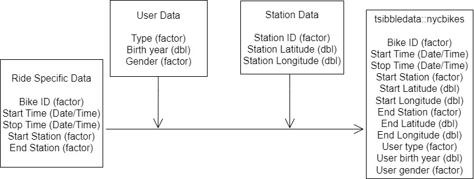

```{r, message = FALSE, warning=FALSE, echo=FALSE}
library(tidyverse)
library(lubridate)
library(janitor)
library(tsibbledata)
library(tsibble)
library(leaflet)
library(sf)
```

```{r}
bikes <- tsibbledata::nyc_bikes

bikes <- bikes %>% 
  mutate(month = month(start_time, label = TRUE),
         date = day(start_time),
         day = wday(start_time, label = TRUE),
         start_hour = hour(start_time),
         stop_hour = hour(stop_time),
         age = 2018 - birth_year)

citi_theme <- theme(axis.text = element_text(size = 10),
                    plot.title = element_text(size = 14),
                    panel.background = element_rect(fill = "#6AB3D9"),
                    panel.grid.minor.y = element_blank()
)
```


<p>Citi Bike is a New York based bike share system launched in 2013. Bikes are docked at stations across the city and can be unlocked for use via the app then returned at any other station. Citi Bike launched in 2013 with 6000 bikes in Manhattan and Brooklyn and has since expanded across the greater New York City area with hundreds more docking stations. In late 2017 the total bikes available grew to 12,000 (double from launch date) and the 50 millionith trip using the bikes was taken. Subscribers pay a monthly fee for access to the bikes including free rides of up to 45 minutes (e-bikes cost extra) while users pay for 30 minutes or a full day.</p>

<p>  
</p>


To grow as a business Citi Bike would like to investigate;

* Patterns of bike hire over time (day, week, year).
* Hire patterns of different demographics.

Analysis of this data will enable Citi Bike to attempt to increase bike hires. This is turn will help gain users and convert users into subscribers.

This report can highlight some ways in which NYC Citi Bikes can look to expand their user base. In particular highlighting specific people to target with advertising to attempt to make them more likely users. It also shows some of the most used docking stations and routes in the area which may pinpoint approximate locations for stations could be added.

Data used is generated as follows from combining data from the ride with user and station data.



## Data issues

The data provided only covers 10 bikes usage in a small area of Jersey City. To make any business decisions it would be vital to see if the trends shown extend to the full data set of all bikes used across the full area served. For instance there is a significant chance the data for bike usage by month is skewed by the presence of more bikes in certain months rather than bikes overall being used more in certain months. For the purpose of this study it has been assumed that these trends would map to the full data set.

Even within the bikes available if a bike were left in a relatively unused docking station there is a higher chance it would not be used for a period of time than if it were in a very frequently used docking station. This could skew the data due to the small sample size.

```{r rows.print = 12}
bikes %>% 
  distinct(bike_id, month) %>%
    count(month) %>% 
  summarise(month, bikes_active_in_month = n)
```
For any data using age, gender == "unknown" was used to filter as there are 243 out of 269 data points which are set at the same value which is assumed to be the default birth year if none is entered. Gender is unknown was used as a proxy to filter this data.

## Data ethics

User data available is limited to type of user, gender and age. In the population of the greater New York area this is sufficient to maintain user anonymity. 

With the data available we can see that the vast majority of user trips are completed within 45 minutes (free for subscribers). It would be a useful user feature to send a notification through the app relating to the ongoing charges once the relevant minimum usage times have been reached.

It would also be beneficial and potentially gain extra subscribers to plot no-subscriber usage over time and inform them if they would be better off financially to opt for a subscription package.


```{r, message = FALSE, warning=FALSE}
bikes %>% 
  mutate(time_of_trip = stop_time - start_time) %>%
  filter(time_of_trip < 45) %>% 
  ggplot(aes(time_of_trip)) + 
  geom_histogram(fill = "#D9261C")+
  labs(x = "Duration of trip",
       y = "Count of trips",
       title = "Histogram of trip duration")+
  citi_theme


bikes %>% 
  mutate(time_of_trip = stop_time - start_time) %>%
  mutate(trip_over_45_mins = ifelse(time_of_trip >45, "yes", "no")) %>% 
  count(trip_over_45_mins)
```
## Breakdown of user demographic

Most users tend to be subscribers. Citi Bike should look to both expand the user base to gain more customers and look to turn more customers into subscribers. 
```{r, message = FALSE, warning=FALSE}
bikes %>% 
  ggplot()+
  geom_bar(aes(x = type, fill = type), fill = c("#D9261C", "#003B70"))+
  labs(x = "Type of user",
       y = "Journeys",
       title = "Total journeys in 2018 by user type")+
  citi_theme
```


The vast majority of users are Male. Citi Bike Should look into reasons why this might be the case and aim to increase awareness of the product within females.

```{r, message = FALSE, warning=FALSE}
bikes %>% 
  ggplot()+
  geom_bar(aes(x = gender, fill = gender), fill = c("#D9261C", "#003B70", "#D9261C"))+
    labs(x = "Gender of user",
       y = "Journeys",
       title = "Total journeys in 2018 by user gender")+
  citi_theme
```

User demographic tends to be younger with an average user age in their mid 30s. This could be for many reasons so should look into some possible factors. Look to increase product awareness and attractiveness to older users.

```{r, message = FALSE, warning=FALSE}
bikes %>% 
  filter(gender != "Unknown") %>% 
  ggplot()+
  geom_histogram(aes(x = age), fill = "#D9261C")+
      labs(x = "Age of user",
       y = "Journeys",
       title = "Total journeys in 2018 by user age")+
  citi_theme
```

### Steps to take
It would be beneficial to survey customers and non-users to gain insights that could be used to provide a service that they would be more likely to use.
An increase in advertising to increase awareness and providing additional locations would be likely to help increase the customer and subscriber base.


## Breakdown of use over time

Data shows that more trips are taken in the warmer months of the year. This may be due to the sample size or may be due to the effects of weather on the ways that people choose to travel.

```{r}
bikes %>% 
  count(month) %>% 
  ggplot(aes(x = month, y = n))+
  geom_line(aes(group = 1))+
  labs(x = "Month",
       y = "Trips taken",
       title = "Trips taken on Citi Bike by month for 2018")+
  citi_theme
```

Data for trips by day across the year is a more reliable data set than by month as the small sample size repeats more multiple weeks. The data shows that the majority of trips are started on a week day. It is expected that this relates to commuting to/from work which can be confirmed by checking the breakdown of what time users begin trips.

```{r}
bikes %>% 
  count(day) %>% 
  ggplot(aes(x = day, y = n))+
  geom_line(group = 1)+
  labs(x = "Day in week",
       y = "Trips taken",
       title = "Trips taken on Citi Bike by day in the week for 2018")+
  citi_theme
```

Data tracking what time of day trips start and finish show very similar patterns as expected by the average trip length previously seen. This bi modal shape matches up with what we would expect for most trips being taken as part of a commute to/from work.

### Steps to take

As previously we should confirm that these data trends line up across the full data set. With it being seen that many trips are conducted as part of a commute to work it would be useful to map various things to attempt to match docking station locations with where people are likely to want to use a Citi Bike. These would include close to areas with lots of large employers (possibly entering partnerships to provide outside certain large employers) and in locations where this lines up with other public transport routes that may not run directly to peoples workplaces.

```{r}
bikes %>% 
  as_tibble() %>% 
  group_by(start_hour) %>% 
  mutate(start_at_hour = n()) %>% 
  ungroup() %>% 
  group_by(stop_hour) %>% 
  mutate(stop_at_hour = n()) %>% 
  ggplot()+
  geom_line(aes(x = start_hour, y = start_at_hour), colour = "#D9261C") +
  geom_line(aes(x = stop_hour, y = stop_at_hour), colour = "#003B70")+
  labs(x = "Hour during which trips starts or ends",
       y = "Count of trips",
       title = "Trips by start time (red) and end time (blue)")+
  citi_theme


```


## Breakdown of usage location

The map below shows the location data for all the stations contained in the data set. It would be worth looking at the areas not covered by a station in close proximity and investigating whether a Citi Bike docking station would be a good transportation option. Some of these areas may be low density residential or other areas that could provide minimal values.

```{r}
leaflet(bikes) %>% 
  addTiles() %>% 
  addMarkers(lng = ~start_long,
                   lat = ~start_lat)
```
The table below show the most commonly used docking stations within the data set. This can be helpful in considering which docking stations may be worth expanding and should be a focus of maintenance if there were ever to be an issue.


```{r, message = FALSE, warning=FALSE}
stations <- bikes %>% 
  group_by(start_station) %>% 
  mutate(start_at_station = n()) %>% 
  ungroup() %>% 
  group_by(end_station) %>% 
  mutate(end_at_station = n()) %>% 
  ungroup()


station_start <- stations %>%
  as.tibble() %>% 
  select(start_station, start_at_station) %>% 
  arrange(start_at_station)

station_end <- stations %>% 
  as.tibble() %>% 
  select(end_station, end_at_station, end_lat, end_long) %>%
  arrange(end_at_station)

station_usage <- station_start %>% 
  full_join(station_end, by = c("start_station" = "end_station"))%>% 
  mutate(total_use = end_at_station + ifelse(is.na(start_at_station),0, start_at_station)) %>% 
  mutate(station = start_station) %>% 
  distinct(station, total_use, end_lat, end_long) %>% 
  arrange(total_use)

station_usage %>% 
  select(station, total_use) %>% 
  arrange(desc(total_use))
```

The following map shows the same data plotted with increasing circle size based on the trips taken from that station. This highlights the importance of stations 3186 (in particular), 3203, 3183, 3195, and 3202 in the use of Citi Bikes in this area.

```{r}
leaflet(station_usage) %>% 
  addTiles() %>% 
  addCircleMarkers(lng = ~end_long,
             lat = ~end_lat,
             label = ~station,
             radius = ~total_use/40,
             weight = 1,
             color = ~"#003B70")
```
This map shows the 20 most common trips taken within the data set. This again shows that many trips originate from the central hub of station 3186 as well as a secondary hubs at station 3202, 3203, 3195 and 3183. 

```{r}
top_20_journeys <- bikes %>%
  as_tibble() %>% 
  rowwise() %>%
  mutate(start_station = as.character(start_station),
         end_station = as.character(end_station)) %>% 
  mutate(a = min(c(start_station, end_station)),
         b = max(c(start_station, end_station)),
         stations = paste(a,b)) %>% 
  select(start_long, start_lat, end_long, end_lat, stations) %>% 
  group_by(stations) %>% 
  mutate(route_use = n()) %>% 
  distinct(stations, .keep_all = TRUE) %>% 
  arrange(desc(route_use)) %>% 
  head(20)
                

top_journey_geo <- top_20_journeys %>% 
  mutate(trip = sprintf('LINESTRING (%s %s, %s %s)', start_long, start_lat, end_long, end_lat)) %>% 
  st_as_sf(wkt = 'trip')
```

```{r}
leaflet(top_journey_geo) %>% 
  addTiles() %>% 
  addPolylines(label = ~stations,
               color = ~"#003B70")
```

## Steps to take

Most stations with a high usage are next to major train stations and it would seem Citi bikes are being used to complete commuters journeys. That suggests that more locations near major public transportation hubs would be likely to be successful locations.


## Conclusions

* Investigate conclusions drawn across data for all bikes and trips across the area served by Citi Bike
* Look to increase customer base and turn customers into subscribers
* Targeted advertising towards women and the over 40's to tap under represented user demographics
* Investigate ways to increase usage on weekends or during middle of the day when bikes are under utilized (discounts, longer free rides)
* Data shows that docking stations located near major public transport hubs get a high amount of usage, look to add docking stations near public transport hubs and expand those already in place
* Further exploration of the bikes at stations at any given time with the full data set would help aid in decisions of which docking stations to expand

Through these methods it should be possible to improve the user base and ensure there are increased bike hires moving forward.