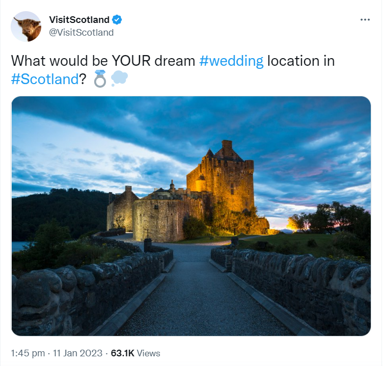
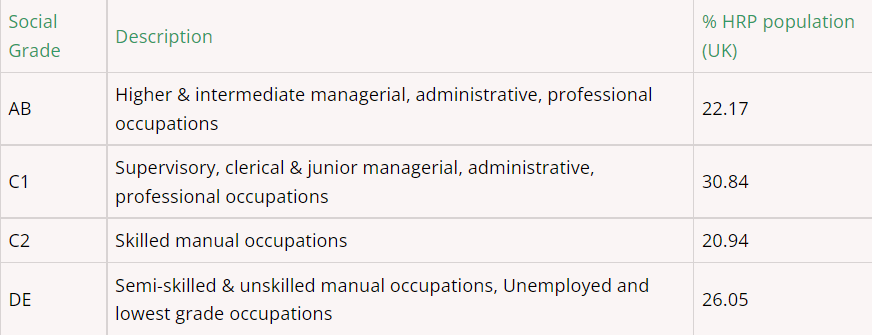

```{r setup, include=FALSE}
knitr::opts_chunk$set(echo = TRUE)
```

```{r, include = FALSE}
library(tidyverse)
library(here)
library(leaflet)
library(sf)
library(png)
library(htmltools)
library(RColorBrewer)
library(pals)

options(scipen = 999)
options(dplyr.summarise.inform = FALSE)
```

```{r, include = FALSE}
visit_theme <- theme(axis.text = element_text(size = 10),
                    plot.title = element_text(size = 14),
                    panel.grid.minor.y = element_blank())

visit_colour <- c("#650360", "#005EB8")
```

```{r, include = FALSE}
activities <- read_csv(here("clean data/activities.csv"))

locations <- read_csv(here("clean data/location.csv"))

travel <- read_csv(here("clean data/travel.csv"))

accomodation <- read_csv(here("clean data/accomodation.csv"))

demographics <- read_csv(here("clean data/demographics.csv"))

rdt <- st_read(here("clean data/regional_data.geojson"))
```


# Introduction

To help Visit Scotland with its goals of realising the potential of the tourism assets throughout Scotland we want to look at data on a range of topics such as;

* What types of activities are visited most and which generate the most revenue?
* What types of location are visited most and which generate the most revenue?
* What methods of transport do tourists use?
* What demographics of people make up the tourist population?
* Which counties of Scotland are most popular with tourists?
* What type of accommodation is more popular in various types of area?

With a better understanding of these type of statistics we can understand what are is more or less popular and from there, determine where more support may be required to help meet demand and where further development is needed. Using this, Visit Scotland can work with private businesses, public agencies and local authorities to improve visitor experience and help various tourism assets reach their potential.

# Data

The data sets used are from statistics.gov.scot. Data was collected using a survey methodology and due to Covid-19 collection was disrupted in 2020 (bar accommodation data).

The data available is all summary data grouped by year and various categories. Due to this any averages will use median rather than mean to minimise the effect of any outlier values.

### _Activities, location, transport and demographic data_

This data was generated using over 35,000 interviews with adults over 16, resident in England, Wales and Scotland during weekly survery waves between 2013 and 2019.

A tourism day trip is defined as taking part in a listed activity, which takes more than 3 hours out of the home and is not done regularly. The activity must not be done in the place of living or work (if started after work). Trips specifically to visitor attractions, live sporting events and special public events did not have to meet all of these criteria.

### _Accomodation data_

This data was produced from a survey completed by the accomodation provider between 2011 and 2021. This survery is sent out monthly and participation of providers varies over time. Geographic locations are defined as follows;

* Large Urban Areas (settlements of over 125,000 people)
* Other Urban Areas (settlements of 10,000 to 124,999 people)
* Accessible Small Towns (settlements of 3,000 to 9,999 people and within 30 minutes drive of a settlement of 10,000 or more) 
* Remote Small Towns (settlements of 3,000 to 9,999 people and with a drive time of over 30 minutes to a settlement of 10,000 or more) 
* Accessible Rural (settlements of less than 3,000 people and within 30 minutes drive of a settlement of 10,000 or more) 
* Remote Rural (settlements of less than 3,000 people and with a drive time of over 30 minutes to a settlement of 10,000 or more)

15 rows only showed a low sample size of data (primarily small hotels and hostels), these will be discounted for the sake of using more reliable data.

### _Regional tourism data_

This data is gathered from surveys and looks at overnight trips taken for any purpose between 2013 and 2019. Some 100,000 residents of Great Britain were contacted and those who had returned from an overnight trip in the past 4 weeks were asked to describe this trip, from which this data was generated.

# What kind of tourism activity generates the highest income for Scotland?

```{r, echo = FALSE}

activities <- activities %>% 
  mutate(gdp_spent_billions = gbp_spent/1000000000,
         visits_millions = visits/1000000)

activities %>% 
  filter(tourism_activity != "All") %>% 
  group_by(tourism_activity) %>% 
  summarise(total_income_billions = round(sum(gdp_spent_billions), digits = 3)) %>% 
  arrange(desc(total_income_billions)) %>%
  mutate(tourism_order = 1:n()) %>%
  mutate(tourism_order = as.character(tourism_order)) %>% 
  ggplot(aes(x = total_income_billions, y = fct_reorder(tourism_activity, total_income_billions), fill = forcats::fct_inorder(tourism_order))) +
  geom_col(fill = "#650360")+
  geom_text(aes(label = total_income_billions),
            nudge_x = 0.9,
            size = 3)+
  theme(legend.position = "none")+
  labs(x = "Total spend (£ billions)",
       y = "Type of tourism activity",
       title = "Total spent on activity")+
  visit_theme


```

The 3 activities that generate the most income for Scotland are going out for meals, shopping for items that would not generally be bought and visits with friends and family, all with over £10 billion generated. This equates to over £1 billion per annum for each of these types of tourism income.

Following these, nights out, outdoor leisure and general days out all generated over £5 billion between 2013 and 2019.

# What kind of activity is the cause of the most visits to sites in Scotland?

```{r, echo = FALSE}

activities %>% 
  filter(tourism_activity != "All") %>% 
  group_by(tourism_activity) %>% 
  summarise(total_visits_millions = sum(visits_millions)) %>% 
  arrange(desc(total_visits_millions)) %>% 
  mutate(tourism_order = 1:n()) %>%
  mutate(tourism_order = as.character(tourism_order)) %>% 
  ggplot(aes(x = total_visits_millions, y = fct_reorder(tourism_activity, total_visits_millions), fill = forcats::fct_inorder(tourism_order))) +
  geom_col(fill = "#005EB8")+
  geom_text(aes(label = total_visits_millions),
            nudge_x = 15,
            size = 3) +
  theme(legend.position = "none")+
  labs(x = "Total visits (millions)",
       y = "Type of tourism activity",
       title = "Total visits to activity")+
  visit_theme


```

The largest reason for visits to sites in Scotland is visiting friends and family with over 300 million visits.

Following this going out for a meal and outdoor leisure activities were both identified as the reason for over 150 million visits.

General days out, nights out and shopping also accounted for more than 100 million visits each.

# What kind of activity generates the most spend per visit?

```{r, echo = FALSE}

activities %>% 
  mutate(spend_per_visit = gbp_spent / visits) %>% 
  filter(tourism_activity != "All") %>% 
  group_by(tourism_activity) %>% 
  summarise(average_spend_per_visit = round(median(spend_per_visit), digits = 2)) %>% 
  arrange(desc(average_spend_per_visit)) %>% 
  mutate(tourism_order = 1:n()) %>%
  mutate(tourism_order = as.character(tourism_order)) %>% 
  ggplot(aes(x = average_spend_per_visit, y = fct_reorder(tourism_activity, average_spend_per_visit), fill = forcats::fct_inorder(tourism_order))) +
  geom_col(fill = "#650360")+
  geom_text(aes(label = average_spend_per_visit),
            nudge_x = 6)+ 
  xlim(0,90)+
  theme(legend.position = "none")+
  labs(x = "Average spend per visit (£)",
       y = "Type of tourism activity",
       title = "Average spend by activity")+
  visit_theme  

```

When looking at the data by the amount spent per visit we can see that shopping for items that you do not regularly buy is highest. Following this meals and special personal events both generated over £50 per visit.

Activities with lower numbers of visits but a high spend per visit would be a good way to increase the income for tourism as a whole across Scotland. Shopping for items that aren't normally bought, special personal events and days out to beauty/health centres and spas all rank relatively low in terms of visits but generate a high spend per visit. 

Popularising Scottish wedding venues or health spas would be a good way to attempt to generate additional revenue as fewer visits would have a proportionally larger effect on overall income. Tweets such as the following may be a good idea to increase and vary, showing beautiful wedding venues and planting the idea of a wedding in Scotland to people. 




# What type of locations receive the most visits and where do people spend the most?

```{r, echo = FALSE}

locations %>% 
  filter(type_of_location_visited != "All areas") %>% 
  mutate(visits_millions = visits / 1000000) %>% 
  group_by(type_of_location_visited) %>% 
  summarise(total_visits_millions = sum(visits_millions)) %>% 
  arrange(desc(total_visits_millions)) %>% 
  mutate(tourism_order = 1:n()) %>%
  mutate(tourism_order = as.character(tourism_order)) %>% 
  ggplot(aes(x = total_visits_millions, y = fct_reorder(type_of_location_visited, total_visits_millions), fill = forcats::fct_inorder(tourism_order))) +
  geom_col(fill = "#650360")+
  geom_text(aes(label = total_visits_millions),
            nudge_x = 15,
            size = 3) +
  theme(legend.position = "none")+
  labs(x = "Total visits (millions)",
       y = "Type of Location",
       title = "Total visits to location")+
  visit_theme

```

Cities and large towns are the most visited locations in Scotland. The number of visits approximately lines up with the expected size/populations of the locations with some possible exceptions around seaside towns.  With visiting friends and family being the top reason for tourism activities it makes sense that visits to the most populated areas would be most common.

```{r, echo=FALSE}

locations %>% 
  filter(type_of_location_visited != "All areas") %>% 
  mutate(spend_billions = gbp_spent / 1000000000) %>% 
  group_by(type_of_location_visited) %>% 
  summarise(total_spent_billions = sum(spend_billions)) %>% 
  arrange(desc(total_spent_billions)) %>% 
  mutate(tourism_order = 1:n()) %>%
  mutate(tourism_order = as.character(tourism_order)) %>% 
  ggplot(aes(x = total_spent_billions, y = fct_reorder(type_of_location_visited, total_spent_billions), fill = forcats::fct_inorder(tourism_order))) +
  geom_col(fill = "#005EB8")+
  geom_text(aes(label = total_spent_billions),
            nudge_x = 1,
            size = 3) +
  theme(legend.position = "none")+
  labs(x = "Total spent (£ billions)",
       y = "Type of Location",
       title = "Total spent in each location")+
  visit_theme

locations %>% 
  mutate(spend_per_visit = gbp_spent / visits) %>% 
  filter(type_of_location_visited != "All areas") %>% 
  group_by(type_of_location_visited) %>% 
  summarise(average_spend = round(median(spend_per_visit), digits = 2)) %>%
  arrange(desc(average_spend)) %>% 
  mutate(tourism_order = 1:n()) %>%
  mutate(tourism_order = as.character(tourism_order)) %>% 
  ggplot(aes(x = average_spend, y = fct_reorder(type_of_location_visited, average_spend), fill = forcats::fct_inorder(tourism_order))) +
  geom_col(fill = "#650360")+
  geom_text(aes(label = average_spend),
            nudge_x = 2,
            size = 3) +
  theme(legend.position = "none")+
  labs(x = "Average spend (£)",
       y = "Type of Location",
       title = "Average spent in each location")+
  visit_theme

```

By a considerable margin the most money is spent in cities and large towns. This is partially due to the fact that this is where most visits occur, alongside the fact things are often more expensive in Cities leading to a higher spend per visit at almost £50. All other locations average a spend of between £29 and £36 per visit apart from Seaside - other which is down at £23. 

People appear to be more likely to spend more money in cities than other locations and understanding these different relative spends will be useful when assisting certain tourism assets in projecting potential revenues based on their location.

# Is there a particular method of travel visitors arrive by? 
```{r, echo=FALSE}
travel <- travel %>% 
  filter(method_of_travel != "All") %>% 
  mutate(visits_millions = visits / 1000000)

travel %>%
  group_by(method_of_travel) %>% 
  summarise(total_visits_millions = sum(visits_millions)) %>% 
  arrange(desc(total_visits_millions)) %>% 
  mutate(tourism_order = 1:n()) %>%
  mutate(tourism_order = as.character(tourism_order)) %>% 
  ggplot(aes(x = total_visits_millions, y = fct_reorder(method_of_travel, total_visits_millions), fill = forcats::fct_inorder(tourism_order))) +
  geom_col(fill = "#650360")+
  geom_text(aes(label = total_visits_millions),
            nudge_x = 20,
            size = 3) +
  theme(legend.position = "none")+
  labs(x = "Total visits (millions)",
       y = "Method of transport",
       title = "Total visits by each method of transport")+
  visit_theme

travel %>% 
  mutate(car_or_not = case_when(method_of_travel == "Car - hired" ~ "Car",
                                method_of_travel == "Car - own/friends/family" ~ "Car",
                                TRUE ~ "Not Car")) %>% 
  group_by(car_or_not) %>% 
  summarise(total_visits_millions = sum(visits_millions)) %>% 
  ggplot(aes(x = total_visits_millions, y = fct_reorder(car_or_not, total_visits_millions), fill = car_or_not)) +
  geom_col()+
  geom_text(aes(label = total_visits_millions),
            nudge_x = 20,
            size = 3) +
  scale_fill_manual(values = rep(visit_colour, length.out = 30))+
  theme(legend.position = "none")+
  labs(x = "Total visits (millions)",
       y = "Method of transport",
       title = "Total visits by each method of transport")+
  visit_theme

```

Car is far and away the most popular form of transport to arrive at these locations by. In fact there is almost double the amount of visits made by car than all other methods of transport combined. This is a good sign for many of the more remote tourism locations that are not serviced by public transport and the majority of the public's chosen method of transport will still allow them to reach these locations. The remoteness of certain destinations may still lead to lower visitor numbers but a lack of public transport would be be completely offputting to the majority of tourists.

The fourth most popular method of transport is walked. This may indicate that a lot of tourism is local domestic tourism with people visiting areas within walking distance of where they live. However this data could also include hikers so may include people who have walked a considerable distance and stopped off for a meal or drink as part of this walk.

```{r, echo = FALSE}

travel %>% 
  mutate(public_or_not = case_when(method_of_travel == "Boat/Ship/Ferry" ~ "Public",
                                   method_of_travel == "Bus or Coach - Minibus" ~ "Public",
                                   method_of_travel == "Bus or Coach - Organised Tour" ~ "Public",
                                   method_of_travel == "Bus or Coach - Regular" ~ "Public",
                                   method_of_travel == "Plane" ~ "Public",
                                   method_of_travel == "Taxi" ~ "Public",
                                   method_of_travel == "Train" ~ "Public",
                                   method_of_travel == "Tram" ~ "Public",
                                   method_of_travel == "Tube" ~ "Public",
                                   TRUE ~ "Not Public"
                                   )) %>% 
  filter(public_or_not == "Public") %>% 
  group_by(method_of_travel) %>% 
  summarise(total_visits_millions = sum(visits_millions)) %>% 
  arrange(desc(total_visits_millions)) %>% 
  mutate(tourism_order = 1:n()) %>%
  mutate(tourism_order = as.character(tourism_order)) %>% 
  ggplot(aes(x = total_visits_millions, y = fct_reorder(method_of_travel, total_visits_millions), fill = forcats::fct_inorder(tourism_order))) +
  geom_col(fill = "#005EB8")+
  geom_text(aes(label = total_visits_millions),
            nudge_x = 5,
            size = 3) +
  theme(legend.position = "none")+
  labs(x = "Total visits by public transport (millions)",
       y = "Method of transport",
       title = "Total visits by each method of transport")+
  visit_theme

```

Within those people who traveled by public transport, train and bus/coach (regular) were the most common transportation taken for visits to tourism activities. Working with major providers of public transport we may be able to find mutually beneficial arrangements that can increase use of their services to reach certain tourism assets, increasing the number of people accessing that asset as well. Discounted tickets with a valid bus or train ticket from that day and some sort of profit sharing agreement based on this could be financially beneficial to both parties.

# What type of accomodation is most popular?

```{r, echo=FALSE}

accomodation %>% 
  filter(location == "All" & weekday_weekend == "All", size_of_accommodation == "All") %>% 
  mutate(accommodation_type_and_occupancy = str_remove_all(accommodation_type_and_occupancy, "Occupancy")) %>% 
  group_by(accommodation_type_and_occupancy, year) %>% 
  summarise(average_occupancy = median(percent_occupancy)) %>% 
  ungroup() %>% 
  ggplot(aes(x = year, y= average_occupancy, colour = accommodation_type_and_occupancy))+
  geom_line(linewidth = 1)+
  labs(x = "Year",
       y = "Average occupancy",
       title = "Average occupancy of different accommodation types",
       color = "Type of accommodation")+
  scale_x_continuous(breaks = 2011:2021)+
  visit_theme+
  theme(panel.grid.minor.x = element_blank(),
        axis.text.x = element_text(angle = 90, vjust = 0.5))+
  scale_colour_brewer(palette = "Set2")

```

The data is not available for the total number of stays in the various types of accommodation so occupancy rates will be used to judge popularity, with more occupied accommodation being deemed more popular than less occupied.

This is the only set of data which runs up to 2021. Due to the impact of Covid-19, this data has been severely impacted with much lower occupancy levels in any kind of accommodation in 2020. While 2021 shows some level of recovery, the majority of accommodation types do not appear to have fully recovered. The data used to answer any business questions will therefore be cut off at 2019 before these unprecedented disruptions that took place.

The type of accommodation which shows the least impact to Covid-19 appears to be caravan and camping parks. With these being fully outdoors this type of accommodation will have seen less restrictions and possibly have been more able to stay open for a larger proportion of the year and seemed more attractive to prospective customers.

```{r, echo=FALSE}
accomodation_to_2019 <-  accomodation %>% 
  filter(year != 2021, year != 2022) %>% 
    mutate(accommodation_type_and_occupancy = str_remove_all(accommodation_type_and_occupancy, "Occupancy"))

accomodation_to_2019 %>% 
  filter(location == "All" & weekday_weekend == "All", size_of_accommodation == "All") %>% 
  group_by(accommodation_type_and_occupancy) %>% 
  summarise(average_occupancy = median(percent_occupancy)) %>% 
  mutate(location = as.factor(c("Large Urban Areas", "Other Urban Areas", "Accessible Small Towns", "Remote Small Towns", "Accessible Rural", "Remote Rural", "All"))) %>% 
  ggplot(aes(x = average_occupancy, y = accommodation_type_and_occupancy, fill = accommodation_type_and_occupancy))+
  geom_col()+
  geom_text(aes(label = average_occupancy),
            nudge_x = 4,
            size = 3) +
  scale_fill_manual(values = rep(visit_colour, length.out = 30))+
  theme(legend.position = "none")+
  labs(x = "Average occupancy (%)",
       y = "Type of accommodation",
       title = "% occupancy of accommodation types")+
  visit_theme
```


Over the full data set across all sizes of accommodation and location bed occupancy is highest in hotels indicating these are the most popular place to stay. The corresponding hotel bed occupancy data shows there are many hotel rooms with multiple beds where not all are occupied and would be expected to always be lower.

With additional data (split geographically rather than by location type) it would be very beneficial to be able to see areas with high occupancy rates which could be somewhere which could sustain additional hotels to increase overall visits. Conversely areas with low occupancy rates may require more publicity to draw more visitors to the area which Visit Scotland could help provide, improving occupancy rates of hotels as well as visitor numbers for local tourism activities.

It would also be of interest to see how the occupancy runs throughout the year in various types of accommodation (and location). It would be expected that accommodation like camping and caravan parks could see a sharp decline over the winter period while this would not be as extreme for hotels.

# Is there a difference is which accomodation is popular at differenet locations?

```{r, echo=FALSE}


accomodation_to_2019 %>% 
  filter(location != "All") %>% 
  filter(weekday_weekend == "All", size_of_accommodation == "All") %>% 
  group_by(accommodation_type_and_occupancy, location) %>% 
  summarise(average_occupancy = median(percent_occupancy)) %>% 
  ggplot(aes(x = location, y = average_occupancy, group = accommodation_type_and_occupancy, colour = accommodation_type_and_occupancy))+
  geom_line(linewidth = 1)+
  visit_theme+
  theme(panel.grid.minor.x = element_blank(),
        axis.text.x = element_text(angle = 90, vjust = 0.5))+
    labs(x = "Type of accommodation",
       y = "Average occupancy",
       title = "Average occupancy of different accommodation types",
       color = "Accommodation type")+
  scale_colour_brewer(palette = "Set2")

```

There are significant difference in the occupancy percentages of different types of accommodation by location, however hotels remain the most popular accommodation type in all locations varying from 77% in large urban areas to 59% in remote small towns.

Self-catering units are the second most popular type of accommodation in accessible rural and large urban areas (55% and 63% respectively) and the second least popular in remote small towns (40%). Demand for this accommodation type clearly varies significantly due to the location.

All types of accommodation have their highest occupancy rates in large urban areas apart from guest houses which seem to benefit from areas of lower population to generate higher occupancy rates. This may be due to lower competition outside of large urban areas or an increased desire for this type of accommodation in less populated locations. These show a peak in occupancy in other urban areas indicating this type of accommodation remains popular in towns, but more so in medium sized towns.

When working with new businesses looking to open various types of accommodation across Scotland this data may be beneficial to assist with their business plans and expectations.

# Is there a particular demographic of visitors that we should be focusing on? Who spends the most and who visits the most?

```{r, echo=FALSE}

demographics <-  demographics %>% 
  mutate(gbp_spent_billions = gbp_spent/1000000000,
         visits_millions = visits/1000000,
         spend_per_visit = gbp_spent/ visits) %>% 
  group_by(category, type) %>% 
  mutate(total_spend = sum(gbp_spent_billions),
         total_visits = sum(visits_millions),
         median_spend_per_visit = median(spend_per_visit)) %>% 
  ungroup() %>% 
  arrange(category, type)
# can do all categories like the example below or as some form of grid
# demographics %>% 
#   filter(category == "access_to_car") %>% 
#   ggplot(aes(x = type, y = spend_per_visit))+
#   geom_col()
# or facet grid them
# demographics %>% 
#   ggplot(aes(x = category, y = visits_millions, fill = type))+
#   geom_bar(position = "stack", stat = "identity")+
#   facet_grid(~category, scales = "free")+
#   theme(axis.text.x = element_text(angle = 90, vjust = 0.5, size = 4))
```


```{r, echo=FALSE}
demographics %>% 
  mutate(type = recode(type, "Employed/self-employed (full or part time)" = "In employment",
                       "In full or part time education" = "In education",
                       "Unemployed/not working" = "Not working")) %>% 
  group_by(category, type) %>% 
  summarise(total_spend_billions = sum(gbp_spent_billions)) %>% 
  ggplot(aes(fill = type, y = total_spend_billions, x = category))+
  geom_bar(position = "stack", stat = "identity")+
  geom_text(aes(label = type), size = 2, position = position_stack(vjust = 0.6)) +
  geom_text(aes(label = total_spend_billions), size = 2, position = position_stack(vjust = 0.4)) +
  theme(legend.position = "none")+
  labs(x = "Demographic category, stacked by type",
       y = "Total spend (£ billions)",
       title = "Total spending of different demographics")+
  visit_theme

demographics %>% 
  mutate(type = recode(type, "Employed/self-employed (full or part time)" = "In employment",
                       "In full or part time education" = "In education",
                       "Unemployed/not working" = "Not working")) %>% 
  group_by(category, type) %>% 
  summarise(total_visits = sum(visits_millions)) %>% 
  ggplot(aes(fill = type, y = total_visits, x = category))+
  geom_bar(position = "stack", stat = "identity")+
  geom_text(aes(label = type), size = 2, position = position_stack(vjust = 0.6)) +
  geom_text(aes(label = total_visits), size = 2, position = position_stack(vjust = 0.4)) +
  theme(legend.position = "none")+
  labs(x = "Demographic category, stacked by type",
       y = "Total visits (millions)",
       title = "Total visits of different demographics")+
  visit_theme

demographics %>%
  distinct(type, .keep_all = TRUE) %>% 
  ggplot(aes(x = type, y = median_spend_per_visit, fill = type))+
  geom_col()+
  facet_grid(~category, scales = "free")+
  theme(axis.text.x = element_text(angle = 90, vjust = 0.5, size = 4),
        legend.position = "none")+
    labs(x = "Demographic category",
       y = "Median spend per visit",
       title = "Median spending by different demographics")+
  visit_theme

```

With only 7 years worth of data available for each category and type there is insufficient points on which to base a model of statistical significance for these different demographics. Due to this more basic summary evaluations must be used.

Access to a car shows a large effect on the amount of money spent (£31 billion to £5 billion) in a large part due to those in cars making over 4 times as many visits. The is also a difference in how much is spent in each visit with those individuals with access to a car spending a median of just over £40 compared to those without spending just under £30.

Age also shows some difference with the youngest and oldest groups spending the least and being some of the most frequent visitors. Those individuals between 25 and 34 and 45 and 54 spend the most of each visit with median values across both groups over £40 per visit. 

When looking at whether individuals have children, those without take almost three times as many trips and spend twice as much money as those with children. However due to the increased size of group on the trip when children are involved the average spend per trip is higher.

Tracking by employment status we can see that those individuals with full/part time jobs spend almost 5 times as much as either those in education or unemployed and make around 5 times as many visits. They also spend more per visit at £44 per visit (£25 for those in education and £32 for those who are unemployed). This supports the idea that these individuals would have additional disposable income to spend on tourism type activities.

When analysing by gender males and females spend a relatively similar amount and make around as many visits with females being slightly higher in each category.

Looking at individuals marital status the total spent is double for married individuals, perhaps indicative of more groups trips (spouse, family) as opposed to unmarried individuals. Married people take around 150 million trips more than unmarried people and spend more over £10 more per trip.

Examining social grade we can see that those in AB spend the most and take the most trips with individuals in C2 making the least trips and those in DE spending the least. This makes some sense when looking at the descriptions of these roles as it could be expected that those in grade AB would have more disposable income and free time in which to take these trips.


Further explanation of social grades


Aiming marketing at these demographics who are more likely to make more visits and spend more money will be useful information for planning advertising campaigns. 

# What insights can we gain from regional tourism? Where are our visitors from and how does the money spent/ nights stayed and visits made compare?

```{r, echo=FALSE}
median_rdt <- rdt %>%
  filter(location != "Scotland") %>% 
  group_by(location, region_of_residence) %>% 
  mutate(average_nights_per_year_millions = median(nights)/1000000,
         average_visits_per_year_thousands = median(visits)/1000,
         average_spend_per_visit = round(gbp_spent/visits, digits = 2)) %>% 
  ungroup()
```


```{r, rows.print = 2}

median_rdt %>% 
  filter(region_of_residence != "All of GB") %>% 
  group_by(region_of_residence) %>% 
  summarise(total_nights_millions = sum(nights)/1000000,
            total_visits_millions = sum(visits)/1000000,
            total_spent_billions = sum(gbp_spent)/1000000000) %>% 
  as_tibble() %>% 
  select(-geometry)
```


With the data for regional tourism only England and Scotland can truly be analysed separately as Wales is grouped with the rest of GB and due to rounding errors the difference disappears in certain areas. This data is concerned with overnight trips for any purpose.

Comparing England and Scotland we can see that people from these two countries accounted for a very similar number of overnight visits to Scotland. However people from England tend to stay for more nights and (therefore) spend more money.

```{r, echo=FALSE}

england_rdt <- median_rdt %>% 
  filter(region_of_residence == "England")

scotland_rdt <- median_rdt %>% 
  filter(region_of_residence == "Scotland")

```

__Visitors from England in terms of total nights stayed in each region__
```{r, echo=FALSE}

# tag.map.title <- tags$style(HTML("
#   .leaflet-control.map-title { 
#     transform: translate(-50%,20%);
#     position: fixed !important;
#     left: 50%;
#     text-align: center;
#     padding-left: 10px; 
#     padding-right: 10px; 
#     background: rgba(255,255,255,0.75);
#     font-weight: bold;
#     font-size: 28px;
#   }
# "))

pal1 <- colorBin("YlOrRd", domain = england_rdt$average_nights_per_year_millions, bins = 7)

labels1 <- labels <- sprintf(
  "<strong>%s</strong><br/>%g Average nights (millions) stayed in region per year",
  england_rdt$location, england_rdt$average_nights_per_year_millions
) %>% lapply(htmltools::HTML)

# title1 <- tags$div(
#   tag.map.title, HTML("Average nights (millions) stayed in region per year by visitors from England")
# )  

leaflet(england_rdt) %>%
  addTiles() %>% 
  addPolygons(fillColor = ~pal1(average_nights_per_year_millions),
              weight = 0.1,
              color = "white",
              fillOpacity = 1,
              label = labels1) %>% 
  addLegend(pal = pal1,
            values = ~average_nights_per_year_millions,
            position = "bottomleft",
            opacity = 1) %>% 
  setView(lat = 58.0000, lng = -5.0000, zoom = 5)

 
  # addControl(title1, position = "topright", className = "map-title")


```


We can see the most popular location for visitors from England is the city of Edinburgh (4.3 million nights stayed per year), with second and third being the Highlands (3.5 million nights stayed per year) and Glasgow city (2.8 million nights stayed per year). With these vistiors from England areas including East Dunbartonshire, East Renfrewshire, Midlothian, Clackmannanshire and West Dunbartonshire all average less than 100,000 nights stayed for visitors from England.

__Visitors from Scotland in terms of total nights stayed in each region__
```{r, echo=FALSE}


pal2 <- colorBin("YlOrRd", domain = scotland_rdt$average_nights_per_year_millions, bins = 7)

labels2 <- labels <- sprintf(
  "<strong>%s</strong><br/>%g Average nights (millions) stayed in region per year",
  scotland_rdt$location, scotland_rdt$average_nights_per_year_millions
) %>% lapply(htmltools::HTML)


leaflet(scotland_rdt) %>%
  addTiles() %>% 
  addPolygons(fillColor = ~pal2(average_nights_per_year_millions),
              weight = 0.1,
              color = "white",
              fillOpacity = 1,
              label = labels2) %>% 
  addLegend(pal = pal1,
            values = ~average_nights_per_year_millions,
            position = "bottomleft",
            opacity = 1) %>% 
  setView(lat = 58.0000, lng = -5.0000, zoom = 5) 


```

The Highlands are the most common area to stay for visitors from Scotland (3.4 million night stayed per year) with Argyll and Bute (1.6 million nights stayed per year) and Perth and Kinross (1.3 million nights stayed per year) coming next. After this come Edinburgh and Glasgow (1.3 and 1.1 million nights stayed per year respectively). These are lower than for England and with lots of the population of Scotland living in the central belt they have less need to make overnight stays (rather than at home) to visit these destinations.

East Renfrewshire, East Dunbartonshire, Midlothian, Clackmannanshire, East Ayrshire, Renfrewshire and South Lanarkshire all get less than 100,000 nights of visits on average each year. A similar list to those where people from England spent less time.

__Visitors from England in terms of total visits to each region__
```{r, echo=FALSE}

pal3 <- colorBin("YlOrRd", domain = england_rdt$average_visits_per_year_thousands, bins = 7)

labels3 <- labels <- sprintf(
  "<strong>%s</strong><br/>%g (thousand) Average visits to region per year",
  england_rdt$location, england_rdt$average_visits_per_year_thousands
) %>% lapply(htmltools::HTML)

leaflet(england_rdt) %>%
  addTiles() %>% 
  addPolygons(fillColor = ~pal3(average_visits_per_year_thousands),
              weight = 0.1,
              color = "white",
              fillOpacity = 1,
              label = labels3) %>% 
  addLegend(pal = pal3,
            values = ~average_visits_per_year_thousands,
            position = "bottomleft",
            opacity = 1) %>% 
  setView(lat = 58.0000, lng = -5.0000, zoom = 5)

```

__Visitors from Scotland in terms of total visits to each region__
```{r, echo=FALSE}

pal4 <- colorBin("YlOrRd", domain = scotland_rdt$average_visits_per_year_thousands, bins = 7)

labels4 <- labels <- sprintf(
  "<strong>%s</strong><br/>%g (thousand) Average visits to region per year",
  scotland_rdt$location, scotland_rdt$average_visits_per_year_thousands
) %>% lapply(htmltools::HTML)

leaflet(scotland_rdt) %>%
  addTiles() %>% 
  addPolygons(fillColor = ~pal4(average_visits_per_year_thousands),
              weight = 0.1,
              color = "white",
              fillOpacity = 1,
              label = labels4) %>% 
  addLegend(pal = pal4,
            values = ~average_visits_per_year_thousands,
            position = "bottomleft",
            opacity = 1) %>% 
  setView(lat = 58.0000, lng = -5.0000, zoom = 5)

```


Popularity for visiting each region largely mirrors where people have spent the most nights with the top 5 destinations for both England and Scotland in terms of nights being the top 5 for visits (albeit in a different order). The main change is an increased popularity of Edinburgh and Glasgow for Scottish tourists in terms of visits. With much of the Scottish population in the central belt this shows overnight stays in these cities remain popular but for shorter stays.

The locations which are least popular too mirrors the data seen for nights bar some of the islands (Orkney and Shetland in particular). With these destinations being more remote we can see that comparatively they are more likely to be stayed in for longer than some mainland destinations, hence fewer visits in comparison to nights stayed.

For the most part these trends maintain in terms of total spend with the most popular locations in terms of nights and visits being the places where people spend the most per visit.


```{r, echo = FALSE, message=FALSE}

median_rdt %>% 
  filter(region_of_residence == "All of GB") %>%
  filter(nights != 0, gbp_spent != 0) %>% 
  group_by(location) %>% 
  mutate(average_length_of_stay = (average_nights_per_year_millions*1000)/average_visits_per_year_thousands,
         average_spend_per_visit = sum(gbp_spent)/sum(visits)) %>% 
  distinct(location, average_length_of_stay, average_spend_per_visit) %>% 
  arrange(desc(average_length_of_stay))

median_rdt %>% 
  filter(region_of_residence == "All of GB") %>%
  filter(nights != 0, gbp_spent != 0) %>% 
  group_by(location) %>% 
  mutate(average_length_of_stay = (average_nights_per_year_millions*1000)/average_visits_per_year_thousands,
         average_spend_per_visit = sum(gbp_spent)/sum(visits)) %>% 
  ggplot(aes(x = average_spend_per_visit, y = average_length_of_stay))+
  geom_point()+
  geom_smooth(method = lm, se = FALSE)+
  geom_text(aes(label = ifelse(average_length_of_stay >5, as.character(location), '')), hjust = 1.1, vjust = 0.2) +
    visit_theme+
  theme(panel.grid.minor.x = element_blank(),
        axis.text.x = element_text(angle = 90, vjust = 0.5))+
  labs(x = "Average spend per visit",
       y = "Average length of stay",
       title = "Spend by length of stay for Scottish counties in each year group")

```

In terms of the average spend per visit we see some of the islands in  particular jump to the top of the list with the longer stays per visit being a major factor in this. The more remote nature of this place means that it takes longer for more tourists to reach makes longer stays more likely.

# How have general tourism rates changed over time?

To examine trends over time we will look at what people do and where they go. This will be done using linear methodology.

```{r, echo = FALSE, message=FALSE}

activities %>% 
  filter(tourism_activity != "All") %>% 
  ggplot(aes(x = year, y = visits_millions, colour = tourism_activity))+
  geom_line(alpha = 0.5)+
  geom_smooth(method = lm, se = FALSE)+
  labs(x = "Year",
       y = "Visits made (millions)",
       title = "Visits by year to different activities",
       color = "Type of activity")+
  scale_x_continuous(breaks = 2011:2021)+
  visit_theme+
  theme(panel.grid.minor.x = element_blank(),
        axis.text.x = element_text(angle = 90, vjust = 0.5))

activities %>% 
  filter(tourism_activity != "All") %>% 
  ggplot(aes(x = year, y = gdp_spent_billions, colour = tourism_activity))+
  geom_line(alpha = 0.5)+
  geom_smooth(method = lm, se = FALSE)+
  labs(x = "Year",
       y = "Money spent (£ billions)",
       title = "Money spent by year on different activities",
       color = "Type of activity")+
  scale_x_continuous(breaks = 2011:2021)+
  visit_theme+
  theme(panel.grid.minor.x = element_blank(),
        axis.text.x = element_text(angle = 90, vjust = 0.5))

locations %>% 
  filter(type_of_location_visited != "All areas") %>% 
  mutate(visits_millions = visits / 1000000) %>% 
  ggplot(aes(x= year, y = visits_millions, colour = type_of_location_visited))+
  geom_line(alpha = 0.5)+
  geom_smooth(method = lm, se = FALSE)+
  labs(x = "Year",
       y = "Visits made (millions)",
       title = "Visits by year in different locations",
       color = "Type of location")+
  scale_x_continuous(breaks = 2011:2021)+
  visit_theme+
  theme(panel.grid.minor.x = element_blank(),
        axis.text.x = element_text(angle = 90, vjust = 0.5))+
  scale_colour_brewer(palette = "Set2")

locations %>% 
  filter(type_of_location_visited != "All areas") %>% 
  mutate(gbp_spent_billions = gbp_spent / 1000000000) %>% 
  ggplot(aes(x= year, y = gbp_spent_billions, colour = type_of_location_visited))+
  geom_line(alpha = 0.5)+
  geom_smooth(method = lm, se = FALSE)+
  labs(x = "Year",
       y = "Money spent (£ billions)",
       title = "Money spent by year in different locations",
       color = "Type of location")+
  scale_x_continuous(breaks = 2011:2021)+
  visit_theme+
  theme(panel.grid.minor.x = element_blank(),
        axis.text.x = element_text(angle = 90, vjust = 0.5))+
  scale_colour_brewer(palette = "Set2")

```


In terms of tourism activities the majority show an increase in visits over time and money spent. Nights out to bars, pubs, clubs etc. only shows a small increase over the time period in terms of visits but showed a significant increase in terms of money spent.

Day trips/excursions for other leisure purposes is the only activity which showed minimal change in terms of visits (though with peaks and troughs through the years) and a decrease in terms of money spent over the time period (potentially due to a large spike in spending for 2014).

In terms of visits and money spent by locations, again a general trend of increase is seen for most locations over the years. The exceptions are seaside - other which shows a significant drop in visits and money spent over this time frame and rural countryside which shows a smaller drop in money spent.

In general these are promising signs for the tourism industry in Scotland, with increased visits and spending over time in the majority of activities and locations.

# Is there any way to predict spending and visits for Visit Scotland?

With only 7 years of data available there is not sufficient data to accurately predict spending or visits for Visit Scotland. If the data were to be split into quarters or months, while we would have less data for each point, more points overall would possibly allow us to make more accurate predictions for the future and look in more detail and what times of year show the most seasonal variation.

Data was not available for the majority of these data sets for 2020 or 2021 due to Covid-19 related travel restrictions affecting data collection. However we can see that from the accommodation data there was a huge impact on tourism and we would expect to see this across most, if not all, of the other data sets available.

Any predictions made based on 2013 to 2019 data would not have been accurate for 2020 due to this unprecedented change in world circumstances. Any attempts to extrapolate for 2022 and beyond would be flawed due to the ongoing effects on the pandemic and now other challenges presented including the cost of living crisis.

We have however seen that in general the amount of visits and spending have increased over time so there is some reason to believe, once the current levels of uncertainty with regards to finance and travel are resolved, there will continue to be an increase in tourism levels for Scotland. 

```{r, echo = FALSE}
accomodation %>% 
  filter(location == "All" & weekday_weekend == "All", size_of_accommodation == "All") %>% 
  mutate(accommodation_type_and_occupancy = str_remove_all(accommodation_type_and_occupancy, "Occupancy")) %>% 
  group_by(accommodation_type_and_occupancy, year) %>% 
  summarise(average_occupancy = median(percent_occupancy)) %>% 
  ggplot(aes(x = year, y= average_occupancy, colour = accommodation_type_and_occupancy))+
  geom_line()+
  labs(x = "Year",
       y = "Average occupancy",
       title = "Average occupancy of different accommodation types",
       color = "Type of accommodation")+
  scale_x_continuous(breaks = 2011:2021)+
  visit_theme+
  theme(panel.grid.minor.x = element_blank(),
        axis.text.x = element_text(angle = 90, vjust = 0.5))+
  scale_colour_brewer(palette = "Set2")

```

# Conclusions

This data can be used to assist Visit Scotland in decision making on where more support may be required for tourism assets and what may benefit from further publicity to increase popularity.

Some of the most popular activities in terms on money generated and visits taken are meals out, shopping, outdoor leisure and visits with friends and family. In terms of spend per visit special personal events and days out to spas/health clubs generate a high value while being low in terms of the number of visits. By attempting to increase the marketing and prevalence of these types of activity it should be possible to increase the overall spend, improving the tourism economy for Scotland as a whole.

Cities are the most popular location with tourists to Scotland and the order of all locations appears to correlate well with the expected population of these locations. This may well relate to the most common reason for visits being to see friends and family and these locations often having more potential tourist activities. Tourism assets in smaller locations may benefit from the increased awareness Visit Scotland could provide to grow their business (especially those in close proximity to cities).

When looking at the method of transport used car is by far the most popular with almost double the number of visits compared to all other methods combined. This bodes well for locations without good public transport links though these may still suffer from their location to some extent. Working with public transport providers may be able to create a mutually beneficial arrangement to improve public transport use and access to tourism destinations.

The most popular type of accommodation in all areas is hotels though popularity of all types varies by location. This information may be of use to Visit Scotland in supporting new types of accommodation by created (building new hotels, opening new camp sites etc.) with expected popularity data based on similar types in similar locations.

By demographics we can see there are certain groups who make the most trips to Scotland and spend the most money. Identification of these keys demographics may be beneficial to targeted marketing campaigns to draw more visitors. Without a full breakdown of how these numbers are summed we cannot fully make this decision (would be able to run a regression model with the original survey data). We can see however that the median spending is highest for;

* People with access to a car

* People aged 25-34 and 45-54

* Individuals without children

* Employed people

* Married couples

* Those in social grades AB and C2.

Viewing regional tourism we can see similar patterns between England and Scotland those trips are generally longer for those based in England. The Highlands, Edinburgh and Glasgow are particularly popular and Visit Scotland should work with assets in this area to provide the best experiences to tourists. A major impact Visit Scotland could have is providing increased awareness of locations in less popular counties to attempt to grow business.

In general tourism is increasing year on year for the majority of locations and activities. However with only 7 years of full data prior to the Covid-19 pandemic it is difficult to predict with any accuracy tourism levels for the future. With 2020 being so disrupted and 2021 not much better any predictions based on 2019 data for the future are unlikely to have a high level of accuracy. We would need to settle in for a few more years and assess recovery from the pandemic before we can make good predictions again. However trends increasing prior to this is a promising sign that recovery should occur.